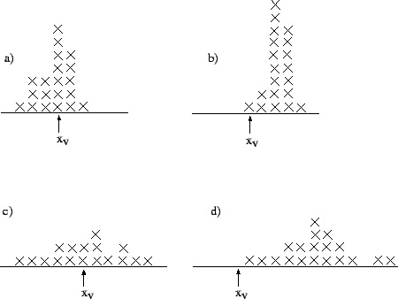
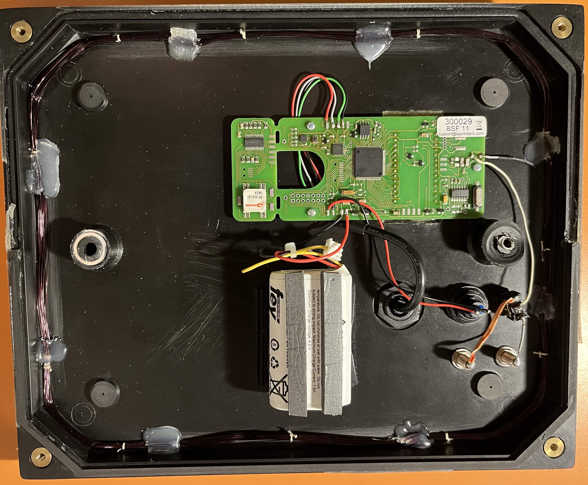
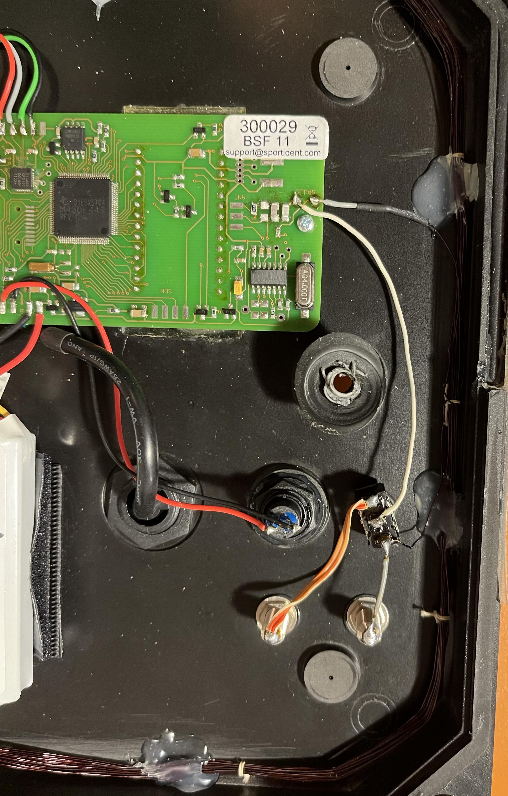

# IOF IT Commission equipment examination

## Who and where

- Coordinator: Edoardo Tona
- Date: March 2<sup>nd</sup>, 2024, 14.00 (CET)
- Place: Vicenza, Italy

Thanks for the equipment and the support to [FICr Vicenza](https://www.cronovicenza.it), Simon Harston, Dmytro Miller, Federico Bruni and the local orienteers.

## Table of contents

- [IOF IT Commission equipment examination](#iof-it-commission-equipment-examination)
  - [Who and where](#who-and-where)
  - [Table of contents](#table-of-contents)
  - [Goals](#goals)
  - [Definitions](#definitions)
    - [Accuracy and precision](#accuracy-and-precision)
      - [Considerations about orienteering](#considerations-about-orienteering)
    - [Sportident punching and timing mode](#sportident-punching-and-timing-mode)
  - [Hardware](#hardware)
    - [Sportident BS11-BL modified for the start gate](#sportident-bs11-bl-modified-for-the-start-gate)
  - [Software](#software)
  - [Protocol](#protocol)
    - [0 - Setup](#0---setup)
    - [1 - Data acquisition](#1---data-acquisition)
    - [2 - Data acquisition](#2---data-acquisition)
    - [3 - Data acquisition](#3---data-acquisition)
    - [4 - Data acquisition](#4---data-acquisition)
    - [5 - Elaboration](#5---elaboration)
    - [6 - Elaboration](#6---elaboration)
  - [Conclusion](#conclusion)


## Goals


The goal is to test Sportident equipment to measure its precision and accuracy with a view to use as timing system in high-level events with TV presence.

In detail we want to measure:

1. Precision and accuracy of a BS11-LA comparing to a photocell.
2. Understand how the precision and the accuracy vary in punching and timing modes.
3. Precision and accuracy of a modified BS11-BL connected to a start gate, comparing to the time recorded by a chronometer (connected to the same gate, on a different channel)

## Definitions

### Accuracy and precision

A sets of measurements of the same measurand involves a component of random error and a component of systematic error.

*Accuracy* is the closeness of the mean of a set of measurement results to the actual true value (low systematic error) and *precision* is the closeness of agreement among a set of results (low random error).

Some examples:



- a) high precision and high accuracy
- b) high precision and low accuracy
- c) low precision and high accuracy
- d) low precision and low accuracy

Mathematically we consider:
- given a single measurement, the **error** is given by the difference between the measured value and the true value 
- given a set of measurements the **accuracy** is the average of the errors. The closer the average is to zero, the higher the accuracy.
- given a set of measurements the **precision** is the standard deviation of the errors. The lower the standard deviation, the higher the precision.

#### Considerations about orienteering

In sport timing measurement:

- Low accuracy (a big systematic error) means that the measurement line is different from the intended one but is the same for all competitors.
- Low precision means that the measurement line is moved during the race and the time is taken at a different position for each competitor.

Every orienteering competition has a different course and there's no "world record" concept for a particular course/distance. Before the first arrival, the position of the finish line can be moved by a few centimeters and nobody cares. This means that we can accept a low accuracy, according to the previous definition.

On the other hand, for a fair result, the finish line position must be the same for all competitors.

In orienteering we define a **reliable timing system** as one that is capable of providing an high precision, regardless of the accuracy.

Accuracy is taken into account when we have to mix measurements taken from different systems (something we should try to avoid). This must be considered even with high accuracy systems, as the measurement line may be different due to the physical arrangement of the instruments

### Sportident punching and timing mode

According to the [Sportident documentation](https://docs.sportident.com/user-guide/en/airplus_system.html#_beacon_mode):

> In orienteering, **Punching mode** is recommended for all controls. The SIAC registers the time and station’s code number when it enters the station’s active field. The SIAC’s feedback signals stay active while the SIAC stays in the station’s active area.
>
> In **Timing mode**, the punching time of the SIAC will be recorded at the maximal field strength. This method enables exact timing at START, FINISH (for any sport) or at every CONTROL point (for sports with different stages for example MTB Enduro). SIAC only provides a feedback after the athlete with the SIAC has left the field with a short flash and beep.
> 
> Because of the SIAC’s late feedback in timing mode we recommend using an AIR+ Signal Indicator for testing purposes.

Timing mode should guarantee an higher accuracy, however some organizers prefer the punching mode (at finish) to get the trigger ASAP and reduce the latency (for TV graphic). Is not clear how using a different mode affect the precision.

## Hardware

- Alge-Timing STSnM2S
  - S/N: // TODO 
- // TODO (photocell)
  - S/N: // TODO 
  - S/N: // TODO 
- Microgate REI Pro
  - S/N: // TODO 
- Finish Lynx
  - S/N: // TODO 
- Sportident BSF-8:
  - CLEAR S/N: // TODO
  - SIAC ON S/N: // TODO
- Sportident BSF-7 USB:
  - S/N: // TODO
- Sportident BS11-LA (ground antenna):
  - S/N: // TODO
  - Battery date:
- Sportident Active Card (SIAC)
- Sportident SRR Dongle
  - (channel blue) S/N: // TODO 
  - (channel red) S/N: // TODO 
- Sportident BS11-BL (modified)
  - S/N: 300029
  - Battery date: // TODO

### Sportident BS11-BL modified for the start gate

This is an aftermarket modification of a BS11-BL station.

The antenna is disconnected and a switch and banana-type socket are added. The start gate is connected using the banana plug and when the gate is open the circuit closes and the antenna connects. The switch allows the gate to be bypassed to keep the circuit closed and the antenna connected (restoring the basic operation of the BS11-BL).

Without the antenna the BS11-BL cannot send any signal to the SIAC. As soon the antenna connects, a signal with the current time reach the SIAC. The SIAC store the time and re-send the punch via the SRR protocol (the BS11-BL is configured as "send last punch").





## Software

- Microgate
  - version: // TODO
  - configuration: // TODO
- Finish Lynx
  - version: // TODO
- jSh Radio gateway
  - version: 1.75 (2023-10-14)
  - on: Windows 11 x64 // TODO

## Protocol

### 0 - Setup

Collect all the serial numbers and software version information to fill the above sections.

The BS11-LA and BS11-BL are left in charge for at least 8 hours the night before the test.

All the SIACs are cleared once.

The box of the BS11-LA must be protected from the direct sunlight could produce heat.

The BS11-LA time is synchronized with a laptop just before the data acquisition. The laptop time must be synchronized via NTP and [time.is](https://time.is) should show a difference lower than 0.1s. The laptop must be connected to the power during the synchronizations.

### 1 - Data acquisition

The BS11 stations are read to collect the internal info.

- **Output**: 1-stations-info.csv

All the SIACs are read (with a BSF-7 USB station) to collect the internal info (S/N, manufacturer and battery date, clear count).

- **Output**: 1-cards-info.csv

### 2 - Data acquisition

// TODO add picture

The setup has (mounted on the same line):
- BS11-LA (timing mode) with send last punch
- 2x photocell mounted at 50cm and 125cm
- Photofinish

The two photocells are connected with a logical AND to the chronometer.

Before each passage the SIAC are cleared and turned on with a SIAC ON station.

The jSh Radio gateway is connected to two SRR USB dongle to receive the Sportident time and via serial cable to the chronometer to receive the photocell time. Everything is saved into a csv file. The computer time is saved, in order to know the latency.

- **Output**: 2-photocell-times.csv
- **Output**: 2-sportident-times.csv

For each passage, the photofinish (working independently) provides two times: looking the position of the chest (id: progressive number of the passage) and the position of the SIAC (id: progressive number multiplied by 1000). 

- **Output**: 2-photofinish-times.csv

### 3 - Data acquisition

Repeat the previous data acquisition, with BS11-LA in punching mode.

- **Output**: 3-photocell-times.csv
- **Output**: 3-sportident-times.csv
- **Output**: 3-photofinish-times.csv

### 4 - Data acquisition

// TODO add picture

The setup has:
- Start gate mounted at 50cm from the ground
- Chronometer connected at channel 1
- BS11-BL (punching mode) with send last punch connected to the start gate at channel 2 

The jSh Radio gateway is connected to two SRR dongle to receive the Sportident time and via serial cable to the chronometer to receive the chronometer time. Everything is saved into a csv file. The computer time is saved, in order to know the latency.

- **Output**: 4-chronometer-times.csv
- **Output**: 4-sportident-times.csv

### 5 - Elaboration 

The photofinish time is used as the real expected value.

Calculate:

```
error(s,p) = time(s) - photofinish_time(p)

accuracy(s,p) = average(errors(s,p))

precision(s,p) = std_deviation(errors(s,p))
```

The following parameters must be varied:
- `s` measured using the system:
  -  photocell
  -  Sportident timing mode
  -  Sportident punching mode
- `p` position for the photofinish measurement:
  - chest
  - SIAC 

Finally all the accuracies and the precisions can be evaluated individually or to compare the systems. 

- **Output**: 5-photocell-chest.csv
- **Output**: 5-photocell-siac.csv
- **Output**: 5-sportident-timing-chest.csv
- **Output**: 5-sportident-punching-chest.csv
- **Output**: 5-sportident-timing-siac.csv
- **Output**: 5-sportident-punching-siac.csv
- **Output**: 5-comparison.md

Expectations:

- [ ] Changing the parameter `p` the precision of the measured system `s` should not be affected (we're moving the measurement line: this affect only the accuracy).
- [ ] Photocell using `p=SIAC` should have a lower accuracy than  `p=chest` 
- [ ] Sportident using `p=chest` should have a lower accuracy than `p=SIAC`
- [ ] Sportident timing mode should have a better accuracy than the punching mode

Questions:

- [ ] How does the precision change between the timing and the punching mode?
- [ ] How the accuracy and precision change between photocell and Sportident?
- [ ] Does the precision of Sportident and Photocell have the same order of magnitude?
- [ ] Which system has the best precision?
- [ ] Can the Sportident be used to collect finish times with a resolution of 0.1 seconds?
- [ ] Can the IOF timing requirements be improved?


### 6 - Elaboration 

To elaborate the start gate time we use the chronometer time as the real expected value.

In this case we can calculate:

```
error = sportident_time - chronometer_time

accuracy = average(errors)

precision = std_deviation(errors)
```

The accuracy and the precision retrieved can be used to evaluate the Sportident system.

- **Output**: 6-sportident-accuracy-precision.csv


Questions:

- [ ] How are the sportident start gate precision and accuracy comparing to the finish ones?
- [ ] Can the Sportident be used to collect start times with a resolution of 0.1 seconds?

## Conclusion

// TODO