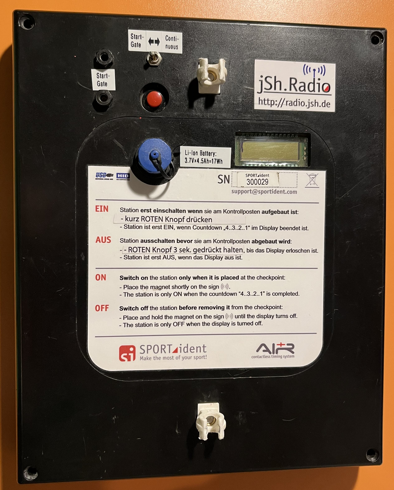

# IOF IT Commission equipment examination

## Summary

This report presents findings from a comprehensive evaluation of the Sportident timing system conducted by the International Orienteering Federation (IOF) IT Commission. The study compared Sportident's performance against traditional photocell and photofinish systems, with the primary goal of assessing its viability for high-level orienteering events with TV presence. The evaluation focused on measuring precision and accuracy in different operating modes, providing crucial data for future timing system decisions.

[Quick link to the conclusions](#conclusion)

## Who and where

- Coordinator: Edoardo Tona
- Date: March 2<sup>nd</sup>, 2024, 14.00 (CET)
- Place: Vicenza, Italy

Thanks for the equipment and the support to [FICr Vicenza](https://www.cronovicenza.it), Simon Harston, Dmytro Miller, Federico Bruni and the local orienteers.

## Table of contents

- [IOF IT Commission equipment examination](#iof-it-commission-equipment-examination)
  - [Summary](#summary)
  - [Who and where](#who-and-where)
  - [Table of contents](#table-of-contents)
  - [Definitions](#definitions)
    - [Accuracy and precision](#accuracy-and-precision)
      - [Considerations about orienteering](#considerations-about-orienteering)
    - [Sportident punching and timing mode](#sportident-punching-and-timing-mode)
  - [Conclusion](#conclusion)
    - [1. Precision and accuracy of a BS11-LA comparing to a photocell.](#1-precision-and-accuracy-of-a-bs11-la-comparing-to-a-photocell)
    - [2. Understand how the precision and the accuracy vary in punching and timing modes.](#2-understand-how-the-precision-and-the-accuracy-vary-in-punching-and-timing-modes)
    - [3. Precision and accuracy of a modified BS11-BL connected to a start gate](#3-precision-and-accuracy-of-a-modified-bs11-bl-connected-to-a-start-gate)
    - [Other considerations](#other-considerations)
  - [Going deeper](#going-deeper)
    - [Hardware](#hardware)
      - [Sportident BS11-BL modified for the start gate](#sportident-bs11-bl-modified-for-the-start-gate)
      - [Resolution](#resolution)
    - [Protocol](#protocol)
      - [0 - Setup](#0---setup)
        - [Clock drift](#clock-drift)
      - [1 - Data acquisition sportident info](#1---data-acquisition-sportident-info)
      - [2 - Data acquisition timing mode](#2---data-acquisition-timing-mode)
      - [3 - Data acquisition punching mode](#3---data-acquisition-punching-mode)
      - [4 - Data acquisition BS11-BL and start gate](#4---data-acquisition-bs11-bl-and-start-gate)
      - [5 - Elaboration SRR and readouts](#5---elaboration-srr-and-readouts)
      - [6 - Elaboration compare sportident and photocell](#6---elaboration-compare-sportident-and-photocell)
      - [7 - Elaboration BS11-BL and start gate](#7---elaboration-bs11-bl-and-start-gate)

## Definitions

### Accuracy and precision

A sets of measurements of the same measurand involves a component of random error and a component of systematic error.

_Accuracy_ is the closeness of the mean of a set of measurement results to the actual true value (low systematic error) and _precision_ is the closeness of agreement among a set of results (low random error).

Some examples:


- a) high precision and high accuracy
- b) high precision and low accuracy
- c) low precision and high accuracy
- d) low precision and low accuracy

Mathematically we consider:

- given a single measurement, the **error** is given by the difference between the measured value and the true value
- given a set of measurements the **accuracy** is the average of the errors. The closer the average is to zero, the higher the accuracy.
- given a set of measurements the **precision** is the standard deviation of the errors. The lower the standard deviation, the higher the precision.

#### Considerations about orienteering

In sport timing measurement:

- Low accuracy (a big systematic error) means that the measurement line is different from the intended one but is the same for all competitors.
- Low precision (a big random error) means that the measurement line is moved during the race and the time is taken at a different position for each competitor.

Every orienteering **competition** has a different course and there's no "world record" concept for a particular course/distance. Before the first arrival, the **position** of the finish line can be moved by a few centimeters and nobody cares. This means that we can accept a low accuracy, according to the previous definition.

On the other hand, for a fair result, the finish line position must be the same for all competitors. We need an high precision.

In orienteering we define a **reliable timing system** as one that is capable of providing an high precision, regardless of the accuracy.

Accuracy is taken into account when we have to mix measurements taken from different systems (something we should try to avoid). This must be considered even with high accuracy systems, as the measurement line may be different due to the physical arrangement of the instruments

### Sportident punching and timing mode

According to the [Sportident documentation](https://docs.sportident.com/user-guide/en/airplus_system.html#_beacon_mode):

> In orienteering, **Punching mode** is recommended for all controls. The SIAC registers the time and station's code number when it enters the station's active field. The SIAC's feedback signals stay active while the SIAC stays in the station's active area.
>
> In **Timing mode**, the punching time of the SIAC will be recorded at the maximal field strength. This method enables exact timing at START, FINISH (for any sport) or at every CONTROL point (for sports with different stages for example MTB Enduro). SIAC only provides a feedback after the athlete with the SIAC has left the field with a short flash and beep.
>
> Because of the SIAC's late feedback in timing mode we recommend using an AIR+ Signal Indicator for testing purposes.

Timing mode should guarantee an higher accuracy, however some organizers prefer the punching mode (at finish) to get the trigger ASAP and reduce the latency (for TV graphic). Is not clear how using a different mode affect the precision.

## Conclusion

In the chart below every dot represent a sample: orange is photocell, dark blue is SI timing mode, light blue is SI punching mode. The x-axes represent the time (s), the time 0 is the photofinish reference. Negative times happen when the samples are recorded before the finish line, positive times after. The y-axes is figurative (represent the sample sequential number).


Distribution chart


### 1. Precision and accuracy of a BS11-LA comparing to a photocell.

- Photocell system shows high precision (SD: 9.8ms), ensuring consistent measurement points for all competitors. Moreover the this systems shows an high accuracy to detect the finish line position (mean 3.2ms). Photocell systems can be safely used to provide results with 0.1s resolution.
- Sportident shows an order of magnitude lower precision (SD: 96.0ms in the best case - punching mode) and a moderately good accuracy (mean: 33.6ms in the best case - timing mode). Sportident system can be safely used to provide results with the whole second resolution.
- The photocell system demonstrates superior precision and should be preferred where precise timing is critical. If the competitions requires the whole second truncation in the final results, the photocells are not strictly required and Sportident system is enought.

### 2. Understand how the precision and the accuracy vary in punching and timing modes.

- The Sportident timing mode shows an higher standard deviation (SD: 140.2ms) due some delayed samples. This suggests that the requirement to reach maximum field strength may introduce additional timing uncertainty.
- The Sportident punching mode introduce a systematic negative offset (mean: -318.5ms) reducing the accuracy. However the recording algorithm seems to be simpler and without the delayed samples the precision is better than the timing mode (SD: 96.0ms vs 140.2ms).
- For orienteering purposes, where consistent measurement position (precision) is more critical than absolute measurement line position (accuracy), the Sportident punching mode seems to be preferable.

### 3. Precision and accuracy of a modified BS11-BL connected to a start gate

The required test could not be carried out. The start gates provided were not able to completely disconnect the BS11-BL antenna and the starting competitor punched the start before the gate opened.

### Other considerations

In the Sportident system, the times recorded with the SRR protocols (used for live results and TV production) were the same as the times read from the cards.

## Going deeper

### Hardware

- Alge-Timing STSnM2S (start gate)
  - S/N: N/A
- Microgate Polifemo (photocell)
  - S/N: 002532
  - S/N: 001935
- Microgate REI Pro
  - S/N: 000276
  - version: 1.14.8 (09/11/2023)
- Finish Lynx
  - S/N: 10176
  - version: 12.20-e (22/12/2022)
- Sportident BSF-8:
  - CLEAR S/N: 158909
  - CHECK S/N: 158173
- Sportident BSF-7 USB:
  - S/N: 133233
  - firmware: 656
- Sportident BS11-LA (ground antenna):
  - S/N: 305475
  - Battery date: 22/06/2023 (4.17V)
- Sportident Active Card (SIAC)
- Sportident SRR Dongle
  - (channel blue) S/N: 218106950
  - (channel red) S/N: 218106450
- Sportident BS11-BL (modified)
  - S/N: 300029
  - Battery date: 26/04/2012 (4.13V)
- Sportident Config+
  - version: 2.11.0

#### Sportident BS11-BL modified for the start gate

This is an aftermarket modification of a BS11-BL station.

The antenna is disconnected and a switch and banana-type socket are added. The start gate is connected using the banana plug and when the gate is open the circuit closes and the antenna connects. The switch allows the gate to be bypassed to keep the circuit closed and the antenna connected (restoring the basic operation of the BS11-BL).

Without the antenna the BS11-BL cannot send any signal to the SIAC. As soon the antenna connects, a signal with the current time reach the SIAC. The SIAC store the time and re-send the punch via the SRR protocol (the BS11-BL is configured as "send last punch").




#### Resolution

- Sportident times are saved at 1/256 of second.
- Photocell times are saved at 1/100 of second.
- Photofinish times are saved at 1/1000 of second.

### Protocol

#### 0 - Setup

Collect all the serial numbers and software version information to fill the above sections.

The BS11-LA and BS11-BL are left in charge for at least 8 hours the night before the test.

##### Clock drift

Any clock suffers of a drift because they don't run exactly at the same clock they are supposed to run. Is not the goal of this test to measure the drift of the clocks used.

To reduce the possibility of a clock drift these the following actions will be taken in consideration:

- Before and after the test the clocks difference must be noted down.
- The BS11-LA time is synchronized with a laptop just before the data acquisition. The laptop time must be synchronized via NTP and [time.is](https://time.is) should show a difference lower than 0.1s. The laptop must be connected to the power during the synchronizations.
- All the data acquisition must be completed within few hours
- The Microgate time is synchronized with GPS just before the test
- All the equipment must be protected from the direct sunlight could produce heat.

#### 1 - Data acquisition sportident info

The BS11 stations are read to collect the internal info.

- **Output**: [2024-03-02_protocol_0.csv](./outputs/sportident%20logs/2024-03-02_protocol_0.csv)
- **Output**: [2024-03-02_protocol_1.csv](./outputs/sportident%20logs/2024-03-02_protocol_1.csv)

All the SIACs are read (with a BSF-7 USB station) to collect the internal info (S/N, manufacturer and battery date, clear count).

- **Output**: [1-cards-info.csv](./outputs/1-cards-info.csv1-cards-info.csv)

#### 2 - Data acquisition timing mode


The setup has (mounted on the same line):

- BS11-LA (timing mode) with send last punch
- 2x photocell mounted at 90cm and 120cm
- Photofinish

The two photocells are connected with a logical AND to the chronometer.

Before each passage the SIAC are cleared and turned on with a SIAC ON station. After each passage the SIAC are read with the USB station.

The Microgate chronometers collect the photocell times internally.

- **Output**: [timing_mode_photocells.xlsx](./outputs/timing%20mode/timing_mode_photocells.xlsx)

Two instances of the jSh Radio controller are connected to two SRR USB dongle to receive the Sportident times. Everything is saved into a csv file. The computer time is saved, in order to know the latency of the SRR protocol.

- **Output**:  [timing_mode_srr.csv](./outputs/timing%20mode/timing_mode_srr.csv)

Sportident Config+ reads the stations to collect the internal memory. There is the possibility the SRR transmitted times and the times read from the SIAC memory are different.

- **Output**:  [timing_mode_readout.csv](./outputs/timing%20mode/timing_mode_readout.csv)

For each passage, the photofinish (working independently) provides two times: looking the position of the chest (id: progressive number of the passage) and the position of the SIAC (id: progressive number multiplied by 1000).

- **Output**: [timing_mode_photofinish.csv](./outputs/timing%20mode/timing_mode_photofinish.csv)

#### 3 - Data acquisition punching mode

Repeat the previous data acquisition, with BS11-LA in punching mode.

- **Output**: [punching_mode_photocells.xlsx](./outputs/punching%20mode/punching_mode_photocells.xlsx)
- **Output**: [punching_mode_srr.csv](./outputs/punching%20mode/punching_mode_srr.csv)
- **Output**: [punching_mode_readout.csv](./outputs/punching%20mode/punching_mode_readout.csv)
- **Output**: [punching_mode_photofinish.csv](./outputs/punching%20mode/punching_mode_photofinish.csv)

#### 4 - Data acquisition BS11-BL and start gate

The setup has:

- Start gate mounted at 50cm from the ground
- Chronometer connected at channel 1
- BS11-BL (punching mode) with send last punch connected to the start gate at channel 2

The jSh Radio gateway and the Sportident Config+ read the times and in the previous acquisition.

- **Output**: no output

#### 5 - Elaboration SRR and readouts

Compare the Sportident times received from the SRR protocol and the times read from the SIAC memory. Merge the SRR times collected by the blue and the red channels

Expectations:

- [ ] All the times must be equal
- [ ] No times lost
- [ ] The majority of the times have been received only on one channel

Calculate the latency between the Sportident times and the laptop internal times:

```
latency = sportident time - laptop time
```

The average of the latency could give an indication about the time we have to wait before to display the time into the TV graphic. Note that the latency measured is related to the first step (from the SIAC to the computer). The latter passages will add more delay.

Expectations:

- [ ] The average latency is less than 100ms

Questions:

- [ ] What is the average latency?
- [ ] What is the difference in latency between timing and punching mode?

#### 6 - Elaboration compare sportident and photocell

The photofinish time is used as the real expected value.

Calculate:

```
error(s,p) = time(s) - photofinish_time(p)

accuracy(s,p) = average(errors(s,p))

precision(s,p) = std_deviation(errors(s,p))
```

The following parameters must be varied:

- `s` measured using the system:
  - photocell
  - Sportident timing mode
  - Sportident punching mode
- `p` position for the photofinish measurement:
  - chest
  - SIAC

Finally all the accuracies and the precisions can be evaluated individually or to compare the systems.

- **Output**: [excel](./outputs/analysis/timing%20vs%20punching%20mode.xlsx)

Expectations:

- [ ] Changing the parameter `p` the precision of the measured system `s` should not be affected (we're moving the measurement line: this affect only the accuracy).
- [ ] Photocell using `p=SIAC` should have a lower accuracy than `p=chest`
- [ ] Sportident using `p=chest` should have a lower accuracy than `p=SIAC`
- [ ] Sportident timing mode should have a better accuracy than the punching mode

Questions:

- [ ] How does the precision change between the timing and the punching mode?
- [ ] How the accuracy and precision change between photocell and Sportident?
- [ ] Does the precision of Sportident and Photocell have the same order of magnitude?
- [ ] Which system has the best precision?
- [ ] Can the Sportident be used to collect finish times with a resolution of 0.1 seconds?
- [ ] Can the IOF timing requirements be improved?

#### 7 - Elaboration BS11-BL and start gate

To elaborate the start gate time we use the chronometer time as the real expected value.

In this case we can calculate:

```
error = sportident_time - chronometer_time

accuracy = average(errors)

precision = std_deviation(errors)
```

The accuracy and the precision retrieved can be used to evaluate the Sportident system.

- **Output**: no output

Questions:

- [ ] How are the sportident start gate precision and accuracy comparing to the finish ones?
- [ ] Can the Sportident be used to collect start times with a resolution of 0.1 seconds?
